# Documento del Proyecto

# Decide-Single-Bailón- Cabina

- Grupo: 2.
-	Curso escolar: 2020/2021
-	Asignatura: Evolución y gestión de la configuración
-	Milestone en el que se entrega la documentación: M3


### Miembros del equipo:


-	Acuña Romero, Carlos Luis
-	Benítez Vega, Daniel
-	Beza Quesada, Laura
-	García Nieto, Antonio Jesús
-	Jordá Arrillaga, Enrique
-	Muñoz del Bot, Pablo 

### Enlaces de interés:

[Organización](http://www.limni.net)

Enlace a cada repositorio:
- [Decide](https://github.com/EGC-decide-bailon/decide)
- [Angular](https://github.com/EGC-decide-bailon/angular-decide-bailon)
- [Bot Discord](https://github.com/EGC-decide-bailon/bot-dc)
- [Bot Telegram](https://github.com/EGC-decide-bailon/bot-telegram)
- [Bot Slack](https://github.com/EGC-decide-bailon/bot-slack)
- [Bot Line](https://github.com/EGC-decide-bailon/bot-line)
- [Documentación](https://github.com/EGC-decide-bailon/Documentos)

Sistemas desplegados:
- [Decide](https://decide-voting.herokuapp.com/)
- [Angular](https://decide-angular-bailon.herokuapp.com/)
- [Bot Discord](https://decide-cabina-bot-discord.herokuapp.com/)
- [Bot Telegram](https://bot-slack-decide-bailon.herokuapp.com/)
- [Bot Slack](https://egc-bailon-bot-slack.herokuapp.com/)
- [Bot Line](https://bot-decide-line.herokuapp.com/)


## Resumen ejecutivo

El grupo **Decide - Single-Bailón - Cabina** se enfrenta con este proyecto a mejora de un sistema previamente diseñado, Decide. Decide es un sistema de votación electronico, desarrollado en su totalidad por una empresa externa al grupo de desarrollo, por lo que se entiende  que los integrantes de este equipo se enfrentarán al código heredado para ser capaz de integran nuevas funcionalidades.

El equipo, como se detalla más adelante, enfocará su esfuerzo en hacer más accesible decide, implementado bots en redes sociales cotidianas. También se pretende mejorar la interfaz gráfica del portal mediante el uso del framework de desarrollo para front-end, Angular.


### Indicadores del Proyecto

| Miembro	| Horas	| Commits |	LoC |	Test | Issues |	Incremento |
| --	| --	| -- |	-- |	--  | -- |	-- |
| Acuña Romero, Carlos Luis	| 65 	| 23 |	+17,200 -739 `1` |	6 | 11 |	Error de CORS |
| Benítez Vega, Daniel	| 65	| 32  |	+612 -181 |	6 | 7 |	Bot de Line |
| Beza Quesada, Laura	| 65	| 27 |	+891 -533 |	6 | 7 |	Interfaz de Angular |
| García Nieto, Antonio Jesús	| 65	| 88 |	+766 -209 |	8 | 8 |	Bot de Discord |
| Jordá Arrillaga, Enrique	| 65	| 33 |	+476 -90 |	7 | 7 |	Bot de Slack |
| Muñoz del Bot, Pablo	| 65	| 24 | +881 -440 |	7 | 6 | Bot de Telegram	 |

**Como detalle es importante destacar que no se ha llevado una cuenta exhaustiva de las horas. Hemos trabajado con la confianza de que cada persona iba ha dar su mejor esfuerzo. Por lo tanto, nos parece correcto que todos tengamos la mísma calificación**

 **`1` - Acuña importo Angular con librerías lo que hace que tanto la cantidad de código escrito como eliminado sea inusual.**

 En la tabla se representa la aportación de cada miembro sobre el proyecto y su trabajo de la siguiente forma:
 
 
-	Commits: solo aquellos hechos por miembros del equipo, no lo commits previos.
-	LoC (líneas de código): solo se tienen en cuenta aquellas producidas por el equipo, no las que ya existían previamente.
-	Test: solo se tienen en cuenta aquellos realizados por el equipo.
-	Issues: Aquellos issues gestionadas dentro del proyecto y por el equipo.
-	Incremento: principal incremento funcional del que se ha hecho cargo el miembro del proyecto

De media todos los compañeros de equipo hemos escrito unas 400 lineas de código lo cual está por encima de lo esperado. Este hecho deja ver un grupo comprometido al trabajo.


### Integración con otros equipos

Al tratarse de un proyecto que realizaremos en solitario (single), este apartado no procede.

### Descripción del sistema 

A lo largo de este apartado, explicaremos el sistema desarrollado desde un punto de vista funcional y arquitectónico. Procuraremos realizar una descripción clara de la funcionalidad técnicas de los componentes que intervienen. 
Para el desarrollo de nuestro proyecto partimos de Decide, un sistema de voto en formato digital compuesta por una serie de módulos o subsistemas, cada uno de estos conectados mediante la API.
Decide-Single-Bailón cabina se encarga de uno de los módulos mencionados anteriormente, en concreto “Cabina de votación”, una interfaz para votar. Este subsistema se encarga de mostrar la interfaz de voto de una votación en concreto, y permite al votante votar de la forma más sencilla posible.
El proyecto consiste en el desarrollo en Angular de esta interfaz, aportando así una interfaz diferente a la ya implementada en Decide. Por otro lado, aportaremos el desarrollo de cuatro bots de votación que permitirán la votación de decide mediante diversas plataformas (Discord, Telegram, Slack y Line).
Ambas partes del proyecto, tanto la interfaz de en Angular como los bots se comunicarán con Decide mediante llamadas a su API para poder realizar las votaciones. 
A continuación, se realizará una explicación más exhaustiva de cada parte del proyecto.

#### Interfaz en Angular.

Angular es un framework para la creacion de webs de una sola pagina basada en componentes.
Un componente necesita una carpeta con 4 archivos principales, un *.html* con la estructura, un archivo *.ts* que contendrá toda la logica relacionada con el template, un archivo *.css* con los estilos.
La gran parte de los documentos relacionados con los estilos estarán vacios, puesto que usaremos el framework bootstrap para todos los estilos.

Tratamos de utilizar el modelo vista controlador para la produccion de esta aplicación concentrando todas las peticiones API al backend desde archivos denominados *.services*, Y almacenando los modelos que recibiamos en su respectivo contendor.

**Modelos**

Almacenan la estructura de los objetos recibidos desde decide. Clases etiquetadas con una librería para analizar cadenas json (*typedjson*)
-   *voting.model.ts* : Crearemos todas las clases correspondientes a la la estructuras de las votaciones. Todas las clases y atributos están etiquetadas para trabajar con objetos json.

```typescript
    @jsonObject
    export class Voting {
        @jsonMember({constructor: Number})
        id: number;
        @jsonMember({constructor: String})
        name: string;
        @jsonMember({constructor: String})
        desc: string;
        @jsonMember({constructor: Question})
        question: Question;
        @jsonMember({constructor: Date})
        // tslint:disable-next-line:variable-name
        start_date: Date;
        @jsonMember({constructor: Date})
        // tslint:disable-next-line:variable-name
        end_date: Date;
        @jsonMember({constructor: PubKey})
        // tslint:disable-next-line:variable-name
        pub_key: PubKey;
        @jsonArrayMember(Auth)
        auths: Auth[];
        @jsonMember({constructor: Object})
        tally: null;
        @jsonMember({constructor: Object})
        postproc: null;
    }
```

**Servicios**

Aquí se concentra todo el código relacionado con el backend, estos archivos proporcionan information relevante a los componentes para que la aplicación funcione correctamente.
Desde llamadas API al framework de python que contiene decide hasta la máquina de estados de login del usuario y el almacenamiento de sus credenciales.
-   *authentication.service.ts* : Gestiona el login y logout del usuario.
-   *voting.service.ts* : Realiza todas las peticiones relacionadas con las votaciones y el usuario. También contiene el código para transformar de json a objeto typescript.

```typescript
    getVotings(): Observable<object> {
        return this.http.get(`${environment.apiUrl}gateway/voting/`);
    }

    parseVotings(votings: any): Voting[] {
        const res: Voting[] = [];
        votings.forEach(v => {
            res.push(v.parseVoting);
        });
        return res;
    }
```
En este codigo vemos como se realizan las llamadas a la api y como son transformadas a objetos typescript

**Componentes**

La aplicación muestra en todo momento el header, la salida de enrutamiento y el footer. La salida de enrutamiento es una herramienta que nos ofrece angular y nos permite cambiar el dom en tiempo de ejecucion.
Veremos el codigo de las votaciones como ejemplo:

-	*voting.component.html* : que contiene el template de la interfaz creada

```html
    <div id="app-booth" class="principal">
        <h1>{{ votingId }} - {{ votingName }}</h1>
        <div *ngIf="logged">
          <h2>{{ votingQuestionDesc }}</h2>
          <form [formGroup]="votingForm" (ngSubmit)="onSubmitVote($event)" novalidate>
            <div class="custom-control custom-radio" >
              <input type="radio" class="form-check-input" id="si" name="option" value="1">
              <label for="si" class="form-check-label" >1. Si</label>
            </div>
            <div class="custom-control custom-radio" >
              <input type="radio" class="form-check-input" id="no" name="option" value="0">
              <label for="no" class="form-check-label" >2. No</label>
            </div>
            <div *ngIf="isSubmitted && myForm.invalid">
              <p>Por favor seleccione una opción</p>
           </div>
            <div class="boton">
              <button class="button button-3" type="submit"> Vota </button>
            </div>
          </form>
        </div>
      <div *ngIf="!logged">
        <h1>No has iniciado sesión</h1>
      </div>
    </div>
```

Como podemos ver usamos la directiva ngIf, esta oculta o muestra parte del html dependiendo del boolean que reciba

-	voting.component.css : Tenemos angular configurado para trabajar con bootstrap, asi que no es necesario añadir estilos en los documentos *.css*

-	voting.component.ts: Se trata del archivo TypeScript que contiene la lógica del componente.

```typescript
    ngOnInit(): void {
        this.logged = !this.authService.isLogged;
        const id = +this.route.snapshot.params.id - 1;
        this.votingService.getVoting(id).subscribe((res) => {
            this.voting = TypedJSON.parse(res[id], Voting);
        }, error => {
            console.log(error);
        });
    }
```
Esta funcion se ejecuta cuando el componente voting es cargado, aquí se pide la consulta de la votacion que es parseada de json a TS gracias a la libreria *typedjson*

-	voting.component.spect.ts : Es el test del componente.

```typescript
    it('should create', () => {
        expect(component).toBeTruthy();
    });
```
Un codigo muy sencillo que comprueba si el componente se crea correctamente.

La funcionalidad de esta parte del proyecto es la siguiente:  

-	Permitir iniciar sesión al usuario mediante el nombre de este y una contraseña.
-	Poder acceder a una lista de votaciones permitidas para el usuario una vez haya iniciado sesión.
-	Cuando se escoge la votación, el usuario puede participar en la misma.

#### Bot de discord.

Comenzaremos analizando la estructura del proyecto.

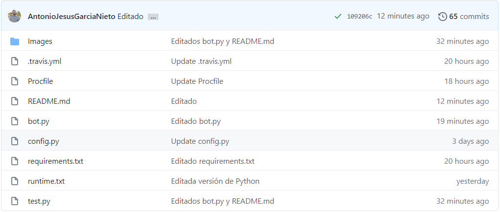

En la imágen superior podemos ver:
- README.md que da una explicación genereal del funcionamiento del bot.
- Images que es una carpeta donde se depositan las imágenes que se muestran en el README.md
- Ficheros de configuración para el despliegue en heroku:
- Procfile, donde se expecifica que queremos un "worker"(una instancia del bot) y no un sistema web, tambien indicamos el idioma en el que se debe ejecutar, en este caso python, y donde está el archivo de arranque, en este caso bot.py.

 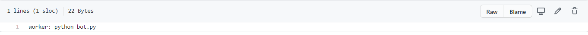

- requirements.txt, en el se indican a heroku cuales van a ser las dependencias, es decir, las librerias necesearias para el funcionamiento del bot.

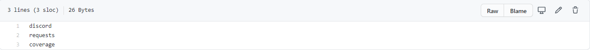
    
- Un fichero para el depliegue en travis : travis.yml. En el usamos los siguientes etiquetas:
            - languaje -> indica el lenguaje que usará travis.
            - python -> indica la versión de python que usaremos.
            - install -> indicaremos que es necesario descargar para la correcta ejecución en el entorno virtual de Travis.
            - script -> indicaremos que script tiene que ejecutar, en este caso el fichero de test (este comando es posible gracias a la librería unitest).
            - deploy - indica opciones referentes al despliegue, en este caso con provider le decimos que lo queremos desplegar con heroku y con on y all_branches le forzamos a que lo haga con todos los cambios.

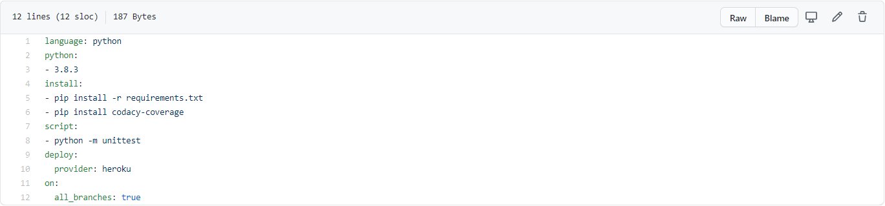

- Como ultimo fichero nos encontramos con el bot.py y config.py, el segundo simplemente son variables globales de configuaración. En lo referente a bot.py ahí es donde sucede la magia. No se va ha realizar una fotografía del código completo, iremos guiandonos por las lineas del fichero y nombres de métodos. Para acceder al código clique [aquí](https://github.com/EGC-decide-bailon/bot-dc/blob/main/bot.py) .Comenzaremos viendo las distintas partes del fichero:

    - Líneas 1 a 7. **Imports**. No hay nada demasiado interesante, importamos las librerías de referentes a la API de Discord, la librería asyncio para poder trabajar de forma asincrona, y la librería request para hacer peticiones. El resto de imports son para dar utilidad.

    - Líneas de la 9 a la 18 y de la 214 a la 219. **Basics**. Se inicializan las partes básicas para el funcionamiento del bot(lineas 9-18) y se crea un evento para que podamos ver en consola que funciona del modo esperado.

    - Líneas de la 22 a las 208. **BotCommands**. En esta sección se encuentran definido los comandos que ejecutará el bot, todos han sido comentados de forma correcta, explicando la funcionalidad del método y los inputs en caso de que sean necesarios. Por ello a continuación dejaremos una lista de comandos y lineas en las que se empiezan y después detallaremos algunos aspectos clave.
        - ##### Lista de comandos
            - 37 -> info
            - 52 -> loginAsUser
            - 88 -> votings
            - 128 -> voting
            - 161 -> vote
            - 200 -> clean
        - ##### Conceptos claves
            Una idea de las ideas detras del funcionamiento del bot es la seguridad en la votación, lo normal es que se llame al bot en un canal, y se interactue con el ahí, sin embargo este bot manda un mensaje directo al usuario que le invoque en un canal público. A nivel de código tan solo necesimos extraer del contexto, por convención ctx, el autor mediante el método .author() y después usamos los comandos .create_dm() y .dm_channel() sobre el autor obtenido para crear el mensaje, esto los usamos mucho. Por ejemplo en el método iniVotación, en concreto en las líneas 31,33 y 34.

    - Líneas de la 224 a las 272. **Utiles**. En esta sección se encuentran definido los comandos que sirven de apoyo a los principales y permiten hacer más comprensible y modular el código. Todos han sido comentados de forma correcta, explicando la funcionalidad del método y los inputs en caso de que sean necesarios igual que en los anteriores. Por ello a continuación dejaremos una lista de comandos y lineas en las que se empiezan.

       - ##### Lista de comandos
            - 228 -> getUser
            - 240 -> saveVoteDate
            - 255 -> parseVotings
    
    - Líneas 276 y 277. **Main**. En estas lineas, tan solo se le indica al bot que comience a funcionar mediante la función .run() pasandole como parametro el token del bot suministrado por Discord.

A modo de resumen,la funcionalidad implementada en esta parte del proyecto es la siguiente:  
- Permitir iniciar sesión al usuario mediante el nombre de este y una contraseña.
- Listar todas las votaciones posibles, una vez el usuario se haya logeado.
- Poder acceder a una votación en detalle, una vez el usuario se haya logeado.
- Permitir al usuario votar,una vez registrado.

#### Bot de Telegram.

Esta es la estructura básica del bot:

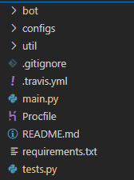

Los puntos más remarcables y distintos a los demás bots son:
 - Bot es una carpeta con todo el código esencial del bot.
 - Configs contiene toda la conmfiguración necesaria para conectar el bot a las distintas plataformas.
 - Util tiene un par de clases de utilidad como código para el parseo de los datos recuperados y la definición de variables globales.
 - Main es el archivo base del bot, con la definición de la estructura y métodos del bot. Este archivo es el que hay que lanzar para iniciar el funcionamiento.

Los demás archivos, menos por mínimas diferencias de configuración, es igual al bot anterior.

Dentro del bot encontramos varias funcionalidades que trabajan a modo de pipeline. En orden, los métodos serían:

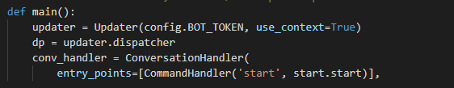

- Aquí definimos el método inicial del bot. Asignamos el comando `start` para iniciar la conversación.

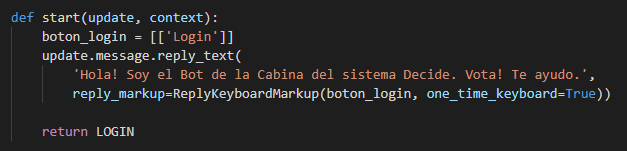

- Creamos con `boton_login = [['Login']]` y `reply_markup=ReplyKeyboardMarkup(boton_login, one_time_keyboard=True)` un botón de login aparte de darle la bienvenida al usuario.
 
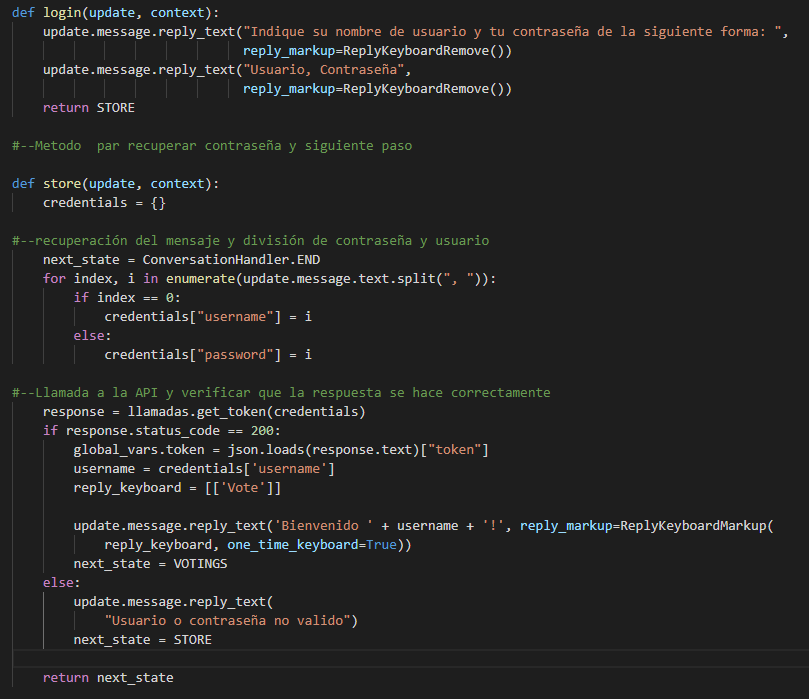

- El primer método que vemos, es el mensaje pidiendo el usuario y contraseña con un formato predefinido.

- El siguiente se compone de varias partes:
  + La recuperación de los datos.
  + Creamos los credenciales con el formato adecuado para enviarlo a la aplicación principal.
  + Comprobamos que la llamada con los credenciales son correctos antes de pasar a la siguiente fase, si no, volvemos a insistir en los credenciales.

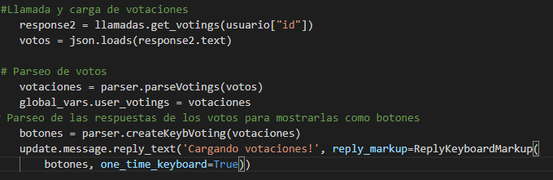

El siguiente paso sería recuperar todas las votaciones existentes y mostrarlas para que el usuario pueda decidir qué hacer.

- Con la primera parte del método, obtemenos la lista de votaciones totales del sistema.

- Cogemos esos objetos y los parseamos y filtramos para coger sólo las votaciones activas.

- Por último y usando los mismos métodos que para crear el botón anterior, creamos uno para cada una de las votaciones.

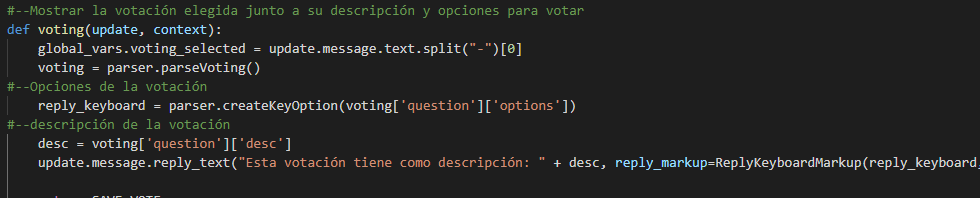

Una vez seleccionado la votación, tendríamos lo siguiente:

- Con la primera parte, recuperamos el id de la votación elegida.

- Después, creamos un botón para cada opción, con el id y la opción a escoger.

- Por último, recuperamos la descripción de la votación para mostrarla por chat junto a los botones creados por cada opción.

En este punto, usamos la misma llamada que con el anterior, ya que si la url la buscamos sin ningún campo id, recuperamos todos los votos y nos ahorramos hacer un método propio para ello.

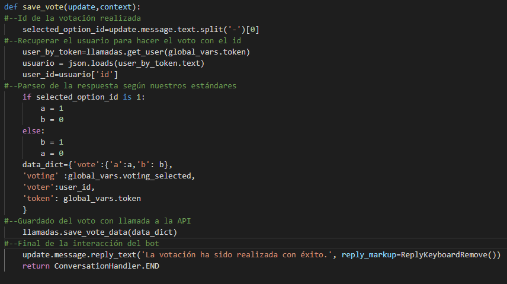

Ya por último, tenemos que guardar ese voto según nuestro estándar:

- Priemro recuperamos el id de la opción recogida.

- Recuperamos el usuario para poder asignarle el voto a él.

- Comparamos la opción para poder adaptar la respuesta a nuestra solución, poniendo un 1 a la opción cogida y un 0 a la que no.

- Guardamos todos los valores necesarios en el formato correspondiente y lo mandamos a la aplicación con su llamada correspondiente.

- Por último y para finalizar el proceso, mandamos un mensaje informando que han realizado la votación correctamente. Con el método `ConversationHandler.END` terminamos el pipeline y estará listo para empezar de nuevo el proceso completo.

Todos los comandos junto al manual de uso, se encuentra en el propio README del bot. Las llamadas y parseos que se ven durante el desarrollo del bot, son iguales a los de los demás bots desarrollados y definidos en esta documentación.

La idea del bot es usarlo de forma privada, ya que en un punto del proceso necesitamos pasarle por escrito las credenciales de nuestro usuario. Debido a la API actual, no podemos borrar ese mensaje sin borrar toda la conversación existente, por lo que si se usa en un grupo, es responsabilidad del usuario el pasar las credenciales por el chat. Una vez terminado el proceso, podemos usar como usuarios, una opción de la aplicación que permite el borrado de los mensajes mandados por ambos y así poder mantener la privacidad de nuestro usuario y contraseña de Decide.

#### Bot de slack.

La estructura del proyecto es similar a los otros bots. Destacaré los archivos más importantes y que ya han sido explicados en la descripción de los otros bots.
- Readme
- Procfile
- requirements.txt donde en mi caso, ha sido necesario añadir las dependecias de slack, flask y gunicorn
- .travis.yml
- config.py donde se guardan las variables globales que estan almacenadas en heroku
- bot.py

En este último es donde se encuentra todo el código del bot. A continuación describiré las partes más interesantes de todo el desarrollo del bot.

- Línea 10. Creamos la aplicación web con Flask(__name__)

- Líneas 17 a 28. /info-comandos Aquí se encuentra el primero método del bot. Es un método bastante sencillo que simplemente envía por chat privado al usuario que ha introducido el comando los diferentes comandos que tiene el bot. Para ello, utilizamos los métodos que nos proporciona la libreria de slack para recibir los datos, y a partir de ahí, coger la id del usuario para abrir el chat con él.

- Líneas 30 a 59. /login-decide En este método es necesario coger la información que el usuario nos manda desde slack y hacer un split, para poder tratar los datos que necesitamos. Este es el primer comando donde se realiza una petición al decide que tenemos desplegado en heroku con los datos que hemos recibido, pero para ello, se realiza la petición dentro de un try/catch, de forma que podamos devolver al usuario un mensaje de error en caso de que no hubiese introducido bien las credenciales. En este caso, se introducide además los datos recogidos en la petición.

- Líneas 60 a 92. /votaciones-disponibles Este método es parecido al anterior, ya que también realizamos una petición a decide, pero esta vez con el requisito de haber logueado antes, ya que para que nos acepte la petición a la api, es necesario mandar el token de haber iniciado sesión. Para este método además utilizamos un método auxiliar llamado cogerVotaciones que veremos a continuación.

- Líneas 94 a 103. En este método auxiliar básicamente cogemos la respuesta nos ha devuelto decide y sacamos las diferentes votaciones disponibles. Una vez las tenemos, filtramos las votaciones que están disponibles y que por tanto, tienen fecha de fin.

- Líneas 106 a 136. /detalles-votacion En este caso, recibimos como parámetro el id de la votación que queremos ver en detalle, y como en los anteriores, se hace una petición a decide con el parámetro recibido para que nos devuelva únicamente la encuesta que hemos solicitado.

- Líneas 138 a 179. /votar-decide Realizamos los mismos pasos que en los anteriores métodos, pero controlando las excepciones de no haber iniciado sesión, o no haber introducido un id de votación o respuesta correctos. Para realizar las dos peticiones lo hacemos mediante dos métodos auxiliares que veremos a continuación.

- Lineas 181 a 197. Se realizan las 2 peticiones a la api de decide.

#### Bot de Line.

Estructura del bot:
- Readme
- Procfile
- requirements.txt conteniendo las dependecias de line, flask y gunicorn
- .travis.yml
- bot.py

Describiré el código únicamente de la clase bot.py, ya que las demás clases son similares o idénticas a las de los otros bots.

- Líneas 15 a 26. Seteamos los token necesarios para comunicarse con Line. Definimos la URL base para todas las peticiones a Decide.

- Líneas 34 a 71. Método al que entran todas las consultas al bot. Aquí se identifica el comando introducido por el usuario y se
redirige al método correspondiente. En caso de no reconocer el comando se comunica al cliente con un mensaje predeterminado.

- Líneas 74 a 77. Comando __/commands_list__. Este método envía un mensaje al cliente con el listado completo de comandos que reconoce el sistema.

- Líneas 79 a 101. Comando __/login__. Extraemos las credenciales proporcionadas por el cliente en su mensaje, y realizamos una llamada a la API de Decide para iniciar sesión en la plataforma. En caso de éxito, se guardará el token proporcionado por Decide en una variable local para futuras peticiones. En caso de error, se informará al cliente con un mensaje de que ha ocurrido un error.

-Líneas 103 a 126. Comando __/info_votaciones__. Recuperamos el token del usuario logeado, y realizamos una llamada a la API de Decide para obtener la lista de votaciones en las que el usuario puede participar. Parseamos la respuesta recibida y tratamos la cadena para poder mostrar por pantalla un resultado ordenado y comprensible. En caso de error, se informará al cliente con un mensaje de que ha ocurrido un error.

- Líneas 129 a 149. Comando __/info_votacion__. Este método es prácticamente idéntico al anterior. La única diferencia es que seleccionamos una votación en concreto del conjunto de votaciones recibido. Se muestran algunos detalles más de la votación en este método que en el anterior.

- Líneas 151 a 185. Comando __/votar__. Recuperamos el ID del usuario en Decide gracias al token previamente almacenado. Extraemos la votación en la que desea participar el cliente y la respuesta que ha indicado (si/no). Si no ha introducido una respuesta adecuada se notificará con un mensaje. Llamamos a la API de Decide para almacenar un nuevo voto con los datos introducidos.En caso de error, se informará al cliente con un mensaje de que ha ocurrido un error.

- Lineas 187 a 188. Cuando no se reconoce un comando, se envía al cliente un mensaje recordándole la existencia del comando __/commands_list__, en caso de que quisiese obtener un listado de los comandos disponibles.

- Líneas 183 a 200. Método para parsear el objeto devuelto por Decide y transformarlo en una lista de votaciones. Únicamente se seleccionan votaciones que hayan empezado pero no hayan acabado aún.

## Visión global del proceso de desarrollo

En esta sección proporcionaremos una visión general del proceso que hemos seguido a lo largo del desarrollo del proyecto.
En nuestro caso concreto, hemos elegido la parte de Cabina como subsistema a desarrollar. Este componente cumple la función de servir de interfaz gráfica al sistema de Decide, por eso desde el grupo `Bailón` hemos apostado por ramas bien diferenciadas:
- Por una parte queríamos modernizar la interfaz actual del portal web haciendo uso de tecnologías más novedosas como Angular.
- Por otra parte, queríamos hacer accesible la funcionalidad del sistema a un mayor número de personas, llevando el alcance de Decide a otras plataformas comúnmente usadas por los usuarios en otros ámbitos como pueden ser Discord, Line, Slack y Telegram; facilitando su uso de forma generalizada.
Teniendo en cuenta lo anterior, cobra sentido el hecho de crear varios repositorios dentro de una organización de forma que todas las funcionalidades estén disponibles para la consulta por todos los miembros del equipo en un mismo sitio, pero manteniendo la individualidad de cada incremento funcional.

Se ha creado un tablero Scrum para la organización general del proyecto, donde se describen todas las tareas, responsables y estados de las mismas. Esto permite tener una visión general del proyecto a todo el equipo durante el proceso completo de desarrollo, permitiendo una mejor comunicación junto con un mayor control del avance del proyecto.

Las tareas se van a definir en su mayoría en una reunión de lanzamiento del proyecto. Iremos mirando todas las funcionalidades añadiendo tareas según las necesidades vistas en cada incremento funcional. Esto no quiere decir que una vez puestas estas funcionalidades, no puedan añadirse más. Si durante el desarrollo de un incremento se detecta una nueva funcionalidad, o alguien requiere ayuda con algo, puede libremente crear un nuevo issue (siguiendo el mismo formato ya seleccionado) y notificar de ello a las partes interesadas del equipo de desarrollo.

Debido a la cantidad de issues presentes en el tablero, para organizarlo un poco más y facilitar la búsqueda de alguna tarea concreta, se han creado dos grupos de desarrollo, `Angular` y `Bots`. Con esto conseguimos diversas ventajas:
 - Cada equipo dispone de un foro propio en el que poder comentar problemas encontrados y que puedan interesar a otros miembros del mismo equipo.
 - Podemos ver una lista de los integrantes de cada grupo, lo que facilita la comunicación con una persona en concreto del mismo equipo.
 - Se puede mencionar a todo el equipo en cualquier comentario sin necesidad de añadir a todos los integrantes.
 - Añade un nivel de jerarquía sobre los documentos, pudiendo elegir el nivel de privilegio de cada grupo de trabajo.
 - Pueden verse los repositorios específicos del grupo en un listado aparte, pudiendo así encontrar cualquiera más rapido entre el listado total.

A la hora de realizar cambios o añadir funcionalidades, se abordarán según estén relacionadas con la mejora visual de la cabina o la creación de bots:
 - En el primer caso, debido a que se trata de una funcionalidad con mayor complejidad que las otras, se va a asignar a dos integrantes del equipo. Por eso, la política de asignación de tareas para este caso concreto atenderá en primer lugar a la disponibilidad de los miembros asignados, es decir, quien tenga posibilidad de desarrollar una nueva tarea por haber terminado la anterior, será asignado a ésta. En segundo lugar, se tendrá en cuenta la prioridad de cada tarea con respecto a las demás, siendo desarrolladas de mayor a menor prioridad. Existe una excepción con las de prioridad `Critical`, ya que deberán ser cogidas por cualquier persona que esté libre, pero esto se desarrollará más adelante. Por último, se tendrán en cuenta las preferencias personales de cada uno.
 - Con los bots es algo distinto, ya que al ser tecnologías bastantes diferentes, hay un responsable más claro para las tareas relativas a cada uno de los bots (aunque esto no implica que una persona no pueda trabajar en dos o más de ellos). Esto supone el primer punto en la política de asignación de tareas, ya que cada miembro cogerá en primer lugar las tareas propias de la tecnología que es experto. El segundo punto, como en el anterior, es la prioridad de las tareas que queden libres.

A continuación, se describe un ejemplo de como se abordarían todo el ciclo hasta llevar un cambio a producción para cada tipo de mejora funcional. Para las mejoras relativas a la cabina el modo de proceder será el siguiente:

1. Se creará una Issue en función de las necesidades del proyecto en la columna de `No Assigned`.
2. Esa tarea se moverá dependiendo de su prioridad a una de las columnas designadas a ello `Critical`, `High` y `Low`.
3. Se crea una rama específica para desarrollar la funcionalidad sin afectar a la rama master con el siguiente formato `feature/palabra-clave`.
4. Se asigna según la política de asignación correspondiente la tarea a un encargado, que la moverá al estado `In progress`.
5. Se empieza a desarrollar la funcionalidad haciendo mínimo un commit al día hasta tener una versión estable.
6. Se crea un pull request y se aprueba si Travis no da fallo y se pasa la issue a `Done`
7. Se elimina la rama y la tarea pasa a `Closed`

Para los bots, el proceso cambia un poco debido a cómo hemos trabajado con ellos, poniendo un repositorio propio para cada uno. Esto no es una decisión interna, ya que era necesario para poder desplegarlos por separado pero manteniendo un orden en nuestros respositorios. El proceso sería el siguiente:

1. Se creará una Issue en función de las necesidades del proyecto en la columna de `No Assigned`.
2. Esa tarea se moverá dependiendo de su prioridad a una de las columnas designadas a ello `Critical`, `High` y `Low`.
3. Como el repositorio es separado para cada bot, se empieza a desarrollar la funcionalidad en local.
4. Se realizan varias pruebas por el desarrollador hasta que se obtenga el funcionamiento esperado.
5. Una vez obtenida una versión estable del bot, se sube el código a la rama master de su propio repositorio.
6. La tarea pasa a estar en `Done`.
7. El bot, es posteriormente desplegado en Heroku a la espera que otro miembro del equipo realice las pruebas oportunas por su cuenta y confirme que la funcionalidad está completa.
8. La tarea pasa a `Closed` a la espera que se conecte con Travis y se hagan sus pruebas unitarias.

## Entorno de desarrollo

Aunque como hemos dicho anteriormente existen diferencias en función al incremento funcional a desarrollar dentro del proyecto, hemos acordado utilizar el mismo ecosistema de desarrollo. Esta decisión la hemos tomado para tratar de evitar los problemas de configuración lo maximo posible y facilitar el "pair programming" en caso de ser necesario.

### Sistema operativo
En cuanto a sistema operativo se refiere utilizaremos Windows 10 (todos contamos con la versión 10 pero no es obligatorio, pues es de pago) y Ubuntu nativo en su versión 20.04.

Hemos decidido usar Ubuntu de forma nativa, pues al principio del proyecto y de la asignatura nos encontramos con numerosos problemas al usar máquinas virtuales y además, los profesores nos dieron la recomendación de instalar Ubuntu en una partición del ordenador para ahorrarnos problemas.

Los SO los hemos usado en función de las necesidades que han ido surgiendo. Al principio del proyecto, antes de tener desplegado Decide en heroku, era necesario desplegar de forma local Decide y probar las funcionalidades desarrolladas, para eso la sintaxis de la consola de comando de Ubuntu era mucho más sencilla y util. Sin embargo, en las etapas finales del proyecto donde teniamos que prestar más atención a la documentación y Decide ya se encontraba desplegado algunos integrantes usaron Windows 10 pues estaban más familiarizados con él.

En cualquier caso el trabajo en ambos sistemas era muy similar, pues se utilizaba el mismo IDE como se detallará a continuación.

### IDEs
Para abordar proyectos de un tamaño mediano o grande es recomendable usar lo que se conoce como IDE.

Los IDE (Integrated Development Enviroment) o en español Entornos de Desarrollo Integrado, aportan un marco de trabajo completo y amigable que permite incrementar la eficiencia y rapidez con la que se desarrolla el código.

En nuestro caso particular hemos decidido utilizar IDEs, en vez de programas de edición de texto como VIM o NANO que aunque son mucho más ligero requieren una curva de aprendizaje mayor, que no era asumible en este proyecto.

En concreto usaremos VSC (Visual Studio Code), porque nos ofrece numerosas ventajas sobre otros IDEs. VSC permíte una sencilla integración de librerías para el desarrollo de código, que permiten implementar desde un coloreado sintactico, con plug-ins como Monokai Night Theme, hasta cambiar los iconos de los archivos según su tipo para simplificar el entendimiento de estos y hacer así más ágil el trabajo (Material Icon Theme). También existen otros plugins que te ayudan a seguir las buenas practicas o autocompletar el código, pero en este caso no lo hemos utilizado. Otro beneficio que hemos encontrado en este IDE, es que integra la consola de comando lo que hace que cualquier tarea como subir codigo a github o abrir algún programa se realize de manera mucho más eficiente.

### Gestor de código

Como gestor de código usaremos Git-Hub, hemos decidido usarlo debido a que era el GC con el que más familiarizados estabamos todos los integrantes del equipo. Esto no es la única ventaja que nos aporta Git-Hub, si no que este además, nos permite crear una organización donde reunir los repositorios y los contribuidores del proyecto, coordinandolos de forma amigable mediante la creación de tableros Kanban donde se reflejan las tareas y avances en este. Además se pueden crear equipos de trabajo, que permiten esquivar la información general de la organización y centrarse en funciones parecidas a la de uno mismo.


### Lenguajes de programación

Nuestro equipo se dividirá en dos equipos de trabajo, `Bots` y `Angular`.
 - El equipo `Angular` basará su trabajo en el framework Angular, y por tanto harán uso de un servidor Node construido en JavaScript. Como lenguajes usaron **JavaScript**, **TypeScript** , **CSS** y **HTML**.

 - El equipo `Bots` usará como lenguaje de programación para el desarrollo de los incrementos funcionales **Python**. El hecho de que usemos todos este lenguaje no es casulidad, lo que buscamos es poder tener una gran transferencia de conocimiento, ya que aunque las APIs propias de cada Bot sean distintas la estructura general de este será bastante similar y es posible que los errores de un Bot los haya resuelto otro desarrollador previamente en su bot.

### Integración continua y despliegue.

Para lo referente a integración continua y despliegue del proyecto hemos usado Travis y Heroku.

Travis es un sistema web que permite realizar integración continua en repositorios públicos de github de forma completamente gratuita. Hemos decidido usar esta herramienta debido a que el equipo ya estaba familiarizada con ella.

Heroku es un sistema web que permite el despliegue de aplicaciones de forma gratuita, ya sea en repositorios publicos o privados de Git-Hub. Hemos decidido usar esta herramienta por recomendación del profesorado.


## Gestión de incidencias

A la hora de tratar las incidencias en un equipo de trabajo con multiples proyectos que desarrollan simultáneamente es un desafió de magnitudes estelares por lo que hemos tratado un plan de gestión de incidencias que no es nada más que una serie de pasos a seguir hasta resolver la incidencia. Estos pasosson los siguientes y deberán siempre seguir los estándares marcados por el equipo y definidos en el documento:

1.  Cuando una incidencia es encontrada se crea una issue dentro del tablero de la organization, esta issue es la central de comunicación sobre la incidencia. Debe de quedar reflejado cada acción que se ha realizado para tratarla. Cualquier persona es libre de crear una incidendia siempre que lo considere necesario en cualquier punto del proyecto.
    1. Esta issue debe de tener unas características de clasificación dependiendo de la incidencia que trate. Si es una mejora en la aplicación se le etiqueta con *enhancement*, si en cambio es una incidencia relacionada con un error se etiqueta con *bug*.
    2. A la incidencia se les coloca una prioridad desde baja a crítica. Las incidencias critica, afecta e impide la continuidad del proyecto, por ejemplo un error en *decide-django*, pudiendo abandonar otras issues para solucionar estas si es altamente necesario. Una incidencia alta involucra a varios proyectos simultáneos y se puede solicitar ayuda de otros equipo de desarrollo externo al equipo que la propone. Las incidencias de baja prioridad afectan a un único proyecto y pueden ser resueltas por una única persona sin ocasionar muchos inconvenientes y sin requerir demasiados recursos.
2.  Cuando un integrante comience a tratar la incidencia se le asigna la issue y se mueve a la sección en progreso.
    1. Si se requiere de ayuda adicional por parte del equipo, se utilizan los comentarios de la issue para las comunicaciones.
    2. Es posible que de una issue aparezcan nuevas incidencias.
3.  Cuando la issue está en un estado muy avanzado y en fase de revisión se coloca en *done* a esperas de cerrarse cuando se apruebe y se añadan los cambios al proyecto.

- - -
Por ejemplo la issue https://github.com/EGC-decide-bailon/angular-decide-bailon/issues/24
1. Antonio detectó un error en la documentación del proyecto en la sección de angular.
2. Creó una incidencia en el proyecto de la organización con la información necesaria para cubrir la incidencia. Le asignó las etiquetas de bug y documentación, lo vinculó al repositorio de los documentos y asignó la tarea al equipo de angular. Por ultimo colocó la issue en baja prioridad.
3. Carlos comunicó que realizaba la tarea y comunicó cuando la tenía finalizada, marcando el commit dónde se resolvió la incidencia para una mejor trazabilidad.
4. Se coloca la issue como finalizada y se cierra. El tablero detecta el cierre de la issue y automáticamente la coloca en la sección de closed

- - -
Otra issue con buena gestión https://github.com/EGC-decide-bailon/angular-decide-bailon/issues/4
1. Laura crea una issue de enhancement que fue asignada a Carlos.
2. Carlos detectó un problema a la hora de tratar la mejora funcional.
3. Dani respondió con una posible solución y la creacion de una issue para tratar la nueva incidencia que surgió al trabajar en otra.
4. La incidencia continua en https://github.com/EGC-decide-bailon/angular-decide-bailon/issues/11 donde se pegan intercambio de correos entre los alumnos y el profesorado.


## Gestión de código fuente

En este apartado se explicarán los procesos, técnicas y herramientas para la gestión del código del proyecto. 

Para abordar este punto, debemos tener en cuenta las funcionalidades que se deben implementar. Trataremos la creación de cuatro bots, y la interfaz de la cabina en angular. Al tratarse de puntos independientes y para facilitar su desarrollo optaremos por la herramienta de gestión de código fuente GitHub. 

GitHub es una herramienta que permite alojar proyectos que se basan en el sistema de versionado de Git. La hemos elegido por varios motivos:
- Porque el proyecto proporcionado por el profesorado se alojaba allí.
- Por nuestro uso previo de dicho sistema y, por lo tanto, la familiarización con el mismo por parte del equipo de desarrollo.
- Nos ofrece la capacidad de crear una organización donde guardar varios repositorios y por lo tanto, trabajar de forma paralela en cada uno de los subproyectos.
- Gracias al punto anterior, cada uno de los subproyectos se puede desarrollar en lenguajes y tecnologías diferentes sin efectos entre sí.
- Permite crear tableros Kanban, donde crear, asignar y organizar las tareas que componen a cada uno de los incrementos funcionales.
- Gracias al punto anterior, permite medir el progreso del proyecto mediante el seguimiento de las tareas creadas.
- Permite crear equipos de desarrollo, dando acceso a los participantes de dicho equipo a un chat privado donde la comunicación es directa y pueden resolver dudas.
- Travis y Heroku son compatibles con esta plataforma, por lo que podremos analizar los errores en el código y desplegarlo en cualquier momento.

Para nuestro caso concreto, hemos decidido crear una organización cuyo nombre es EGC-decide-bailon (https://github.com/EGC-decide-bailon), que se compone de una serie de repositorios, cada uno dedicado a un incremento funcional. En concreto se han creado los siguientes: 

- bot-line, dedicado al desarrollo del bot decide en Line. (https://github.com/EGC-decide-bailon/bot-line)

- bot-dc, para el desarrollo del bot orientado a la aplicación Discord.(https://github.com/EGC-decide-bailon/bot-dc)

- bot-slack, dedicado al desarrollo del bot decide para Slack.
(https://github.com/EGC-decide-bailon/bot-slack)

- bot-telegram, para el desarrollo del bot en Telegram.
(https://github.com/EGC-decide-bailon/bot-telegram)

- angular-decide-bailon, para el el desarrollo de la interfaz de la cábina con angular.(https://github.com/EGC-decide-bailon/angular-decide-bailon)

- Documentos, donde residirán todos los documentos pertinentes a este proyecto.
(https://github.com/EGC-decide-bailon/Documentos)

- decide, el proyecto base de decide, facilitado por el profesorado.
(https://github.com/EGC-decide-bailon/decide)


Antes de empezar el desarrollo general de cada uno de los incrementos funcionales crearemos las diferentes issues en el tablero Kanban proporcionado por GitHub, asignándole a cada una un subproyecto/repositorio. Cada miembro del equipo se encargará de uno de los incrementos funcionales, excepto para angular-decide-bailon, de la que se encargarán hasta dos miembros debido a su complejidad. 

Concretamente, al crear la issue, se le proporcionará una etiqueta dependiendo del tipo de tarea que sea, en el caso de ser una tarea de funcionalidad llevará la etiqueta “enhancement”, si de lo contrario se trata de una tarea de desarrollo de documentación, llevará la etiquieta “documentation”, por último, si se trata de un error que debe ser corregido llevará la etiqueta de “bug”. Posteriormente, se le asignará a la issue un grado de prioridad, y se depositará en una de las columnas que indiquen esa información : “Critical priority”, “High priority”, y “Low priority”. Una vez situada en una de estas tres columnas la issue, se le asignará a un miembro del equipo para que la lleve a cabo. Si la issue se ha iniciado se colocará en la columna “In progress”, si se ha finalizado se colocará en”Done”, y si además se ha revisado y aceptado, pasará a “Closed”. 

Aquí se adjuntan unas capturas de pantalla que demuestran su utilización.


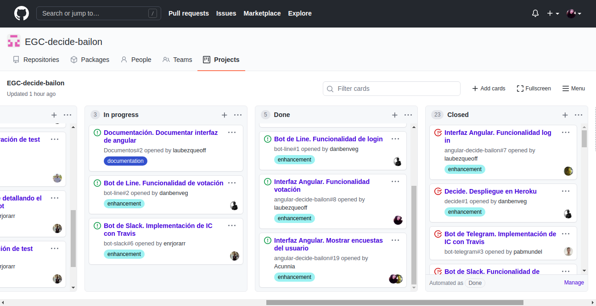


Dentro de la organización hemos creado dos equipos, el equipo encargado de los bots, y el equipo encargado de angular. El primer equipo seguirá una política menos estricta, ya que cada uno de los componentes se encargará de un bot de forma individual, por lo que será el único que edite el código del repositorio asignado al desarrollo de su bot. En los repositorios de bot, se harán los commits y cambios directamente en la rama master. La política a seguir para realizar los commits para comprobar que el código desarrollado hasta el momento se ha realizado correctamente, excepto para los casos en los que se tengan que probar o editar ficheros de cara al despliegue de la aplicación, en ese caso se podrán realizar los commits directamente. 

Sin embargo, el segundo llevará una política algo más concreta, ya que dos personas trabajarán sobre el mismo incremento funcional por lo que tendrán acceso al mismo repositorio y deberán trabajar sobre el mismo código.


En el caso de angular-decide-bailon, utilizaremos como técnica “Modelo vista controlador”. 
Referente al repositorio, se creará una branch según la funcionalidad a realizar con el siguiente nombre “feature/palabra-clave”, siendo la palabra clave booth,voting,votings,etc… A la hora de commitear los cambios se realizarán al menos uno al día hasta tener una versión definitiva sin errores. Una vez se haya realizado la funcionalidad en su rama correctamente, se realizará un pull request que deberá ser aprobado por Travis y por la revisión de otro compañero de proyecto. Una vez mergeada la rama sin errores se eliminará y la issue se dará por finalizada. 

Lo explicado anteriormente se puede ver reflejado en las siguientes imágenes:

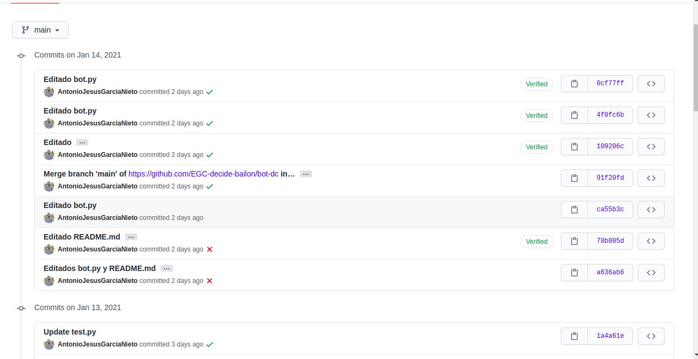
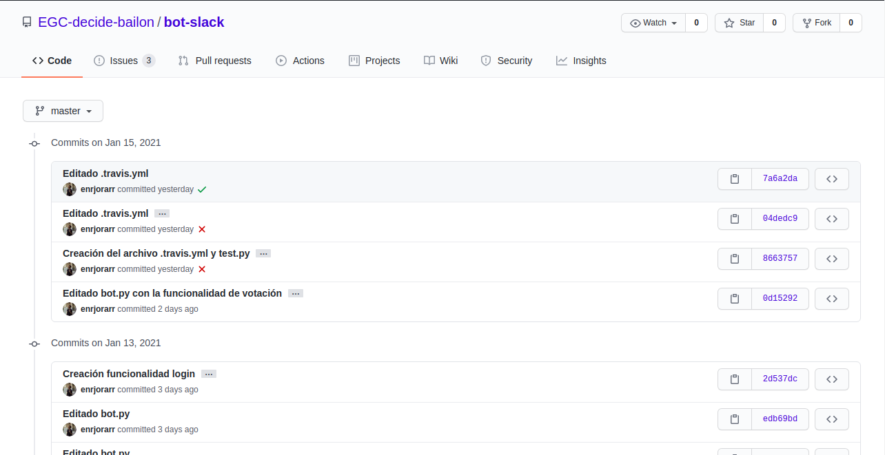

Las palabras clave para el nombrado de los commits , tanto referente a los repositorios de los bots como para angular-decide-bailon, será la acción : creado/añadido, editado ,eliminado, arreglado/corregido,  de la clase o componente al que le afecte.
Esto se ve reflejado en el proyecto en las siguientes imágenes: 

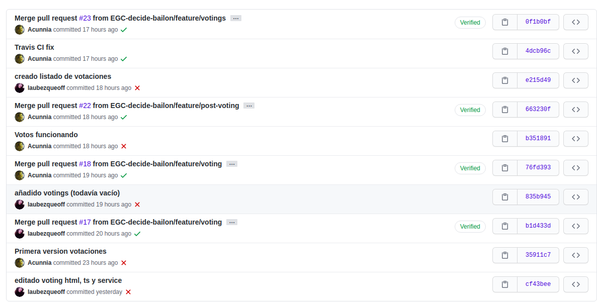
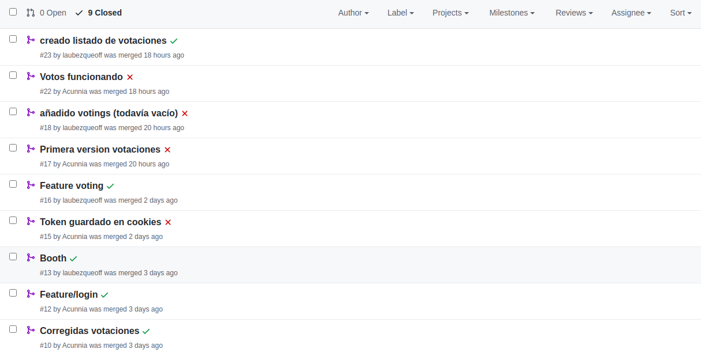


## Gestión de la construcción e integración continua

Debido a nuestra casuística, la integración continua en la parte de los bots, resulta un poco complicada de aplicar debido a que son bloques bastante separados e individuales si los comparamos a nuestro desarrollo relativo a la interfaz gráfica desarrollada con Angular sobre el subsistema Cabina(Booth). Aun así, las pruebas de código e integraciones de los distintos bloques de cada parte diferenciada se harán siguiendo el esquema propuesto por dicha metodología. Tomamos esta decisión debido a las ventajas que ofrece como el control de errores en fases tempranas del mismo, evitando que se vayan haciendo cada vez mayores y acumulándose todo al final, y también comprobar que vamos construyendo un código uniforme donde todo va funcionando en conjunto a lo desarrollado anteriormente.

Viendo nuestro proyecto de forma global y teniendo en cuenta las divisiones realizadas, algunas características sobre la integración continua presentes son:

1. Como ya hemos mencionado anteriormente, para cada incremento funcional teníamos un repositorio propio, ya que debíamos desplegar cada parte de forma individual, pero están todos dentro de la misma organización para poder así tener todo el código en un mismo sitio y poder tener un control global. La gestión de cada repositorio depende del responsable del propio incremento, pero queda definido un estándar global y queda establecido un mínimo de calidad para todo el mundo.

2. El repositorio de la interfaz gráfica mediante Angular, al tener más de un responsable dentro trabajando, para evitar conflicto en las ramas principales de desarrollo, se automatizaron los builds con Travis. Estas ramas en concreto son master y develop, donde se hacen los commit de forma más formal y sin errores aparentes. Debido a esto, necesitamos asegurarnos uniformidad en todo el código y que pasen unos test automáticos que aseguren un mínimo de calidad. En los demás repositorios no es estrictamente necesario aunque sí es bastante recomendable su uso, ya que aunque casi todo lo vaya a desarrollar una misma persona, ayuda a que los demás puedan entender mejor el código por si surge algún error o se necesita la ayuda de otro miembro del equipo.

3. De nuevo, en la parte de Angular del proyecto, si hemos podido seguir los consejos de hacer un commit al día, por lo menos en la última parte del proyecto, ya que al principio solo nos centramos en la resolución del problema que nos generaba el CORS. En el desarrollo de los bots, la cosa se nos complicó, por lo que hubo días que sólo se dedicaron a estudiar las API’s correspondientes o simplemente hubo avances pero se probaron o quedaron de forma local.

4. Para hacer estos commits, implantamos un formato sencillo, pero que permita crear una uniformidad y un sentido al código subido. Para los nuevos archivos o partes importantes nuevas, los títulos van siempre precedidos de la palabra `Creado`. Para los archivos que reciban una actualización o se agreguen cosas pero de menor tamaño con respecto al total, empezarán por `Editado`. Y por último, para los borrados, se precede por `Eliminado`.
En cuanto a la creación de actividades, antes de la descripción del mismo, también se ha establecido unos identificativos propios para los distintos incrementos funcionales.

5. Para tener siempre la última versión de nuestro código desplegado en la nube, por cada repositorio, se ha desplegado en Heroku su rama master, lo que nos permite tener una versión actualizada de los avances a disposición del resto del equipo por si quieren hacer pruebas o necesitan de sus servicios en algún momento.

6. Sobre la división de los dos grupos, cada uno es libre de autogestionarse como quiera, pero la comunicación entre ellos es básica y esencial para el buen funcionamiento del equipo.

7. Como se ha nombrado antes, en la parte de Angular se va a usar Travis para el corregir el formato del código, más concretamente se usará Lint. Dentro del archivo .travis.yml antes de hacer el build del proyecto, se ejecutan estos scripts que revisarán todo el código de Angular.

Todos y cada uno de los scripts se encuentran dentro del archivo tslint.json y contiene código como el siguiente:

```typescript
"max-classes-per-file": false,
    "max-line-length": [
      true,
      140]
Donde se define un formato para las líneas de código, dándole un máximo de longitud de 140. O este ejemplo donde se muestra todo el formato del propio texto:
    "component-class-suffix": true,
    "contextual-lifecycle": true,
    "directive-class-suffix": true,
    "no-conflicting-lifecycle": true,
    "no-host-metadata-property": true,
    "no-input-rename": true,
    "no-inputs-metadata-property": true,
    "no-output-native": true,
    "no-output-on-prefix": true,
    "no-output-rename": true,
    "no-outputs-metadata-property": true,
    "template-banana-in-box": true,
    "template-no-negated-async": true,
    "use-lifecycle-interface": true,
    "use-pipe-transform-interface": true,
    "directive-selector": [
      true,
      "attribute",
      "app",
      "camelCase"]
```
Gracias al uso de esta configuración aparte de lo dicho anteriormente, nos ayuda a prevenir bad smells en todo el código, como líneas vacías, atributos no usados, imports innecesarios.

## Gestión de liberaciones y entregas

## Propuesta de cambio

## Conclusiones y trabajos futuros

Daremos dos conclusiones sobre este trabajo , por un lado una referente a los bots y por otro uno que haga referencia a la incorporación de Angular como front-end.
Empezaremos con los bots. De cara a los proximos años proponemos un avanze tanto vertical como horizontal. Por un lado de forma vertical, proponemos profundizar en el desarrollo de los bots incluyendo elementos de interacción por voz (Discord) o integrando una forma de interactuar mediante el uso de botones, deslizables o incluir animaciones.También se podría integrar un servicio para iniciar sesión a traves de terceros, evitando así tener que escribir las credenciales en un mensaje de texto y evitando los riesgos que ello acarrea.
Además, en el sentido del progreso horizontal proponemos la integración de otros bots, una plataforma muy interesante es What's Up.

Respecto a la parte de Angular, ha sido una experiencia muy enriquecedora. Por un lado nos hemos enfrentado a problemas nuevos como son el error de CORS, conexión entre servidores ... etc . Proponemos de cara a los proximos años, que utilicen este proyecto como plantilla o como consulta para solucionar rapido errores típicos y así poder centrarse en la creación de interfaces novedosas para el resto de modulos, incluyendo vistas con videos, animaciones, cargas dinámicas ...

En definitiva hemos aprendido mucho, tanto tecnológicamente como a nivel de interacción de grupo, y en especial de cara al uso de herramientas de gestión de código fuente colaborativas como Git Hub.
