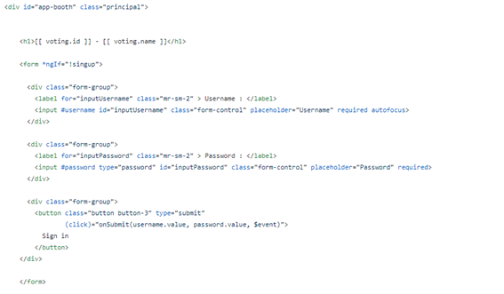
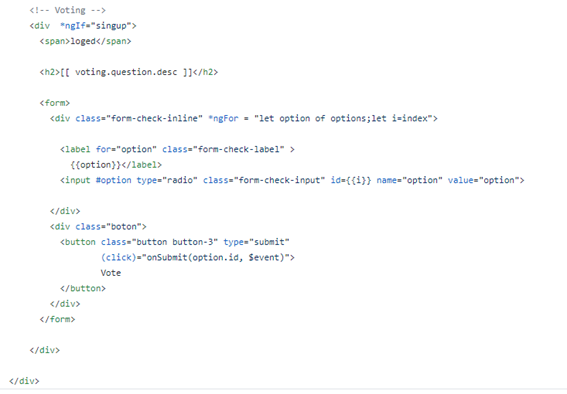
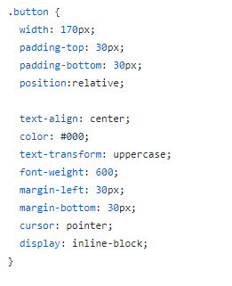
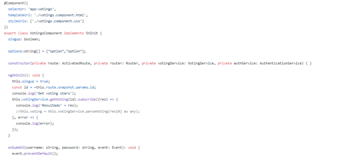
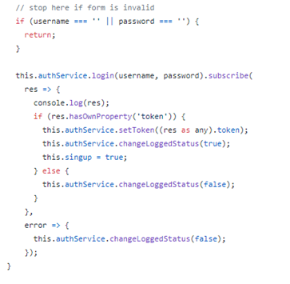
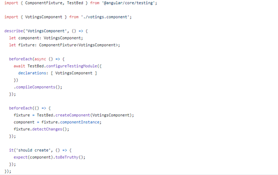

# Documento del Proyecto

# Decide-Single-Bailón- Cabina

- Grupo: 2.
- ID de opera: - 
-	Curso escolar: 2020/2021
-	Asignatura: Evolución y gestión de la configuración
-	Milestone en el que se entrega la documentación: M3

### Miembros del equipo:

-	Acuña Romero, Carlos Luis
-	Benítez Vega, Daniel
-	Beza Quesada, Laura
-	García Nieto, Antonio Jesús
-	Jordá Arrillaga, Enrique
-	Muñoz del Bot, Pablo 

### Enlaces de interés:

-	repositorio de código
-	sistema desplegado
-	cualquier otro enlace de interés

## Resumen ejecutivo

### Indicadores del Proyecto

| Miembro	| Horas	| Commits |	LoC |	Test | Issues |	Incremento |
| --	| --	| -- |	-- |	--  | -- |	-- |
| Acuña Romero, Carlos Luis	| 	|  |	 |	 |  |	 |
| Benítez Vega, Daniel	| 	|  |	 |	 |  |	 |
| Beza Quesada, Laura	| 	|  |	 |	 |  |	 |
| García Nieto, Antonio Jesús	| 	|  |	 |	 |  |	 |
| Jordá Arrillaga, Enrique	| 	|  |	 |	 |  |	 |
| Muñoz del Bot, Pablo	| 	|  |	 |	 |  |	 |

 En la tabla se representa la aportación de cada miembro sobre el proyecto y su trabajo de la siguiente forma:
 
 
-	Commits: solo aquellos hechos por miembros del equipo, no lo commits previos.
-	LoC (líneas de código): solo se tienen en cuenta aquellas producidas por el equipo, no las que ya existían previamente.
-	Test: solo se tienen en cuenta aquellos realizados por el equipo.
-	Issues: Aquellos issues gestionadas dentro del proyecto y por el equipo.
-	Incremento: principal incremento funcional del que se ha hecho cargo el miembro del proyecto

### Integración con otros equipos

Al tratarse de un proyecto que realizaremos en solitario (single), este apartado no procede.

### Descripción del sistema 

A lo largo de este apartado, explicaremos el sistema desarrollado desde un punto de vista funcional y arquitectónico. Procuraremos realizar una descripción clara de la funcionalidad técnicas de los componentes que intervienen. 
Para el desarrollo de nuestro proyecto partimos de Decide, un sistema de voto en formato digital compuesta por una serie de módulos o subsistemas, cada uno de estos conectados mediante la API.
Decide-Single-Bailón cabina se encarga de uno de los módulos mencionados anteriormente, en concreto “Cabina de votación”, una interfaz para votar. Este subsistema se encarga de mostrar la interfaz de voto de una votación en concreto, y permite al votante votar de la forma más sencilla posible.
El proyecto consiste en el desarrollo en Angular de esta interfaz, aportando así una interfaz diferente a la ya implementada en Decide. Por otro lado, aportaremos el desarrollo de dos bots de votación que permitirán la votación de decide mediante los canales de texto de discord.
Ambas partes del proyecto, tanto la interfaz de en Angular como los bots se comunicarán con Decide mediante llamadas a su API para poder realizar las votaciones. 
A continuación, se realizará una explicación más exhaustiva de cada parte del proyecto.

#### Interfaz en Angular.

Para poder crear la interfaz, deberemos crear un componente en Angular con esa intención.
Este componente está compuesto por un archivo que contendrá el Template (.html), un archivo que contendrá la lógica (.ts),
y un archivo para el css donde se diseñará la apariencia de la interfaz. 
Concretamente, hemos creado el componente de la cabina , denominado “votings” con los siguientes archivos :

-	Votings.component.html : que contiene el template de la interfaz creada. En este archivo hemos utilizado el elemento *ngIf propio en el Angular en el form, ya que la votación solo se puede realizar si el usuario ha iniciado sesión, de esta forma y utilizando este elemento no aseguramos de que en caso de que el usuario no haya iniciado sesión se le presente una vista donde pueda hacerlo (Imagen1) y a continuación proceda a votar, o en el caso de que si esté loggeada pueda acceder directamente a la votación (Imagen 2). 

-	Votings.component.css: En el archivo html se utiliza Bootstrap, aún así decidimos utilizar botones diseñados mediante css para darle un toque más original a la interfaz de de la cabina.

-	Votings.component.ts: Se trata del archivo TypeScript que contiene la lógica del componente. Podemos observar su código en las Imágenes 4 y 5.

-	Votings.component.spect.ts : Es el test del componente, que comprobará si todo funciona como ha sido previsto.

La funcionalidad de esta parte del proyecto es la siguiente:  

-	Permitir iniciar sesión al usuario mediante el nombre de este y una contraseña.
-	Poder acceder a una votación una vez el usuario haya iniciado sesión.
-	Una vez elegida la votación, que el usuario puede participar en la misma.

#### Bot de discord.

Comenzaremos analizando la estructura del proyecto.

En la imágen superior podemos ver:
- README.md que da una explicación genereal del funcionamiento del bot.
- Images que es una carpeta donde se depositan las imágenes que se muestran en el README.md
- Ficheros de configuración para el despliegue en heroku:
- Procfile, donde se expecifica que queremos un "worker"(una instancia del bot) y no un sistema web, tambien indicamos el idioma en el que se debe ejecutar, en este caso python, y donde está el archivo de arranque, en este caso bot.py.

 

- requirements.txt, en el se indican a heroku cuales van a ser las dependencias, es decir, las librerias necesearias para el funcionamiento del bot.

    
- Un fichero para el depliegue en travis : travis.yml. En el usamos los siguientes etiquetas:
            - languaje -> indica el lenguaje que usará travis.
            - python -> indica la versión de python que usaremos.
            - install -> indicaremos que es necesario descargar para la correcta ejecución en el entorno virtual de Travis.
            - script -> indicaremos que script tiene que ejecutar, en este caso el fichero de test (este comando es posible gracias a la librería unitest).
            - deploy - indica opciones referentes al despliegue, en este caso con provider le decimos que lo queremos desplegar con heroku y con on y all_branches le forzamos a que lo haga con todos los cambios.

## Visión global del proceso de desarrollo

En esta sección proporcionaremos una visión general del proceso que hemos seguido a lo largo del desarrollo del proyecto.
Para el desarrollo del proyecto creamos un repositorio en Github, del que formamos parte todos los componentes del equipo. A raíz de este, y dependiendo de las tareas generadas, creamos ramas donde los miembros puedan avanzar en secciones del código que no se crucen con el avance del resto para así optimizar

## Entorno de desarrollo
## Gestión de incidencias

